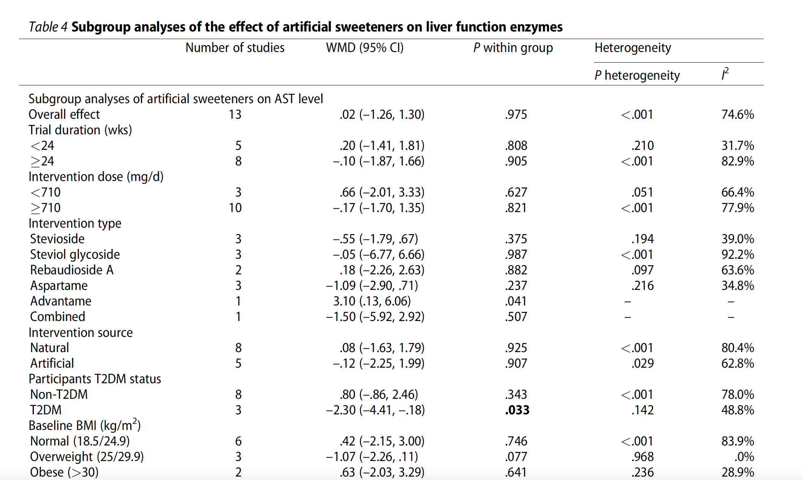

So far, we have learned what meta-analysis is and how it is generally performed. In this section, we will dive into subgroup analysis—as the name suggests, this involves performing meta-analyses within specific groups in your dataset.

## Subgroup Analyses

Subgroup analyses are especially important when there is **high heterogeneity** in your main meta-analysis, indicating differences across studies. By conducting subgroup analyses, we not only identify potential **sources of heterogeneity**, but also gain deeper insights into the data. Therefore, it is highly recommended to still perform subgroup analyses even if the overall heterogeneity is very low, so that you can gain more interpretation from your data.

> **Important Note**: Subgroup analysis is usually performed using a Fixed model.

### Finding source of heterogeneity

Let's back to our sample dataset [Sample Data](https://github.com/csc-ubc-okanagan/csc-data-blog/blob/main/content/post/2025-07-08-meta-analysis-on-randomized-clinical-trials-part-4/Sample_data.csv). In the previous part, our meta-analysis on the entire dataset showed an I^2 value of 66.8% and a p-value of 0.0003, indicating **significant** heterogeneity across studies.

As a start, we can begin by performing subgroup analyses based on **gender**. Simply put, we want to understand how the effect changes when we separate the analysis by gender.

To perform a subgroup analysis by gender using the `meta` package in R, we can use the `byvar` argument in `metacont()`. Since subgroup analysis is typically done using a fixed-effect model, we’ll set `comb.fixed = TRUE` and `comb.random = FALSE`:


``` r
library(readr)
library(meta)

# Sample data
sample_data <- read_csv("sample_data.csv", show_col_types = FALSE) 

gender_subgroup_analysis <- metacont(
  ## Experimental group
  n.e      = n_int,
  mean.e   = mean_change_CRP_int,
  sd.e     = SD_change_CRP_int,

  ## Control group
  n.c      = n_con,
  mean.c   = mean_change_CRP_con,
  sd.c     = SD_change_CRP_con,

  ## Study labels
  studlab  = `author name`,
  data     = sample_data,

  ## Effect size
  sm       = "MD",

  ## Pooling model: Fixed-effects only for subgroup
  comb.fixed  = TRUE,
  comb.random = FALSE,

  ## Subgroup variable
  byvar    = gender
)

# View results
summary(gender_subgroup_analysis)
```

```
##                              MD              95%-CI %W(common) gender
## Dalgard et al. 2009     -0.1000 [ -0.9532;  0.7532]        2.1   male
## Rafraf et al. 2012      -0.1000 [ -0.4015;  0.2015]       17.2 female
## Daud et al. 2013         0.0000 [ -9.0265;  9.0265]        0.0   both
## El-sisi et al. 2013      0.4900 [ -0.8664;  1.8464]        0.8   male
## Mah et al. 2013         -0.7700 [ -3.6288;  2.0888]        0.2   both
## Shadman et al. 2013     -0.4300 [ -1.9034;  1.0434]        0.7   male
## Gopalan et al. 2014     -2.6900 [ -6.1718;  0.7918]        0.1   both
## Hejazi et al. 2015       2.0000 [ -2.8210;  6.8210]        0.1 female
## Modi et al. 2015        -2.9000 [ -4.3745; -1.4255]        0.7   both
## Ramezani et al. 2015    -0.2800 [ -1.6243;  1.0643]        0.9   male
## Stonehouse et al. 2016   0.4500 [ -0.3826;  1.2826]        2.3   both
## Pervez et al. 2018      -0.4800 [ -0.6246; -0.3354]       74.8 female
## Rachelle et al. 2011   -12.2000 [-19.0863; -5.3137]        0.0 female
## 
## Number of studies: k = 13
## Number of observations: o = 718 (o.e = 360, o.c = 358)
## 
##                          MD             95%-CI     z  p-value
## Common effect model -0.3981 [-0.5231; -0.2731] -6.24 < 0.0001
## 
## Quantifying heterogeneity (with 95%-CIs):
##  tau^2 = 0.4537 [0.3269; 23.3053]; tau = 0.6735 [0.5717; 4.8276]
##  I^2 = 66.8% [40.5%; 81.5%]; H = 1.74 [1.30; 2.32]
## 
## Test of heterogeneity:
##      Q d.f. p-value
##  36.15   12  0.0003
## 
## Results for subgroups (common effect model):
##                   k      MD             95%-CI     Q   I^2   tau^2    tau
## gender = male     4 -0.0764 [-0.6605;  0.5076]  0.98  0.0%       0      0
## gender = female   4 -0.4114 [-0.5417; -0.2811] 17.18 82.5% 23.9487 4.8937
## gender = both     5 -0.4722 [-1.1591;  0.2146] 16.74 76.1%  2.2715 1.5071
## 
## Test for subgroup differences (common effect model):
##                    Q d.f. p-value
## Between groups  1.25    2  0.5353
## Within groups  34.90   10  0.0001
## 
## Details of meta-analysis methods:
## - Inverse variance method
## - Restricted maximum-likelihood estimator for tau^2
## - Q-Profile method for confidence interval of tau^2 and tau
## - Calculation of I^2 based on Q
```

So we have the overall effect along with separate analyses based on gender (***Results for subgroups***).

Now, let’s generate the **forest plot** for our subgroup analysis results:


``` r
# ── Forest plot ──────────────────────────────────────
forest(gender_subgroup_analysis,
       fs.hetstat = 6,

       # ── layout options ─────────────────────────────────
       leftcols   = c("studlab"),
       rightcols  = c("effect", "ci", "w.fixed"),  # WMD, 95% CI, weight
       rightlabs  = c("WMD",   "95% CI", "Weight"),

       # ── cosmetic tweaks ────────────────────────────────
       sortvar    = year,  # Make sure 'year' column exists in your data
       xlab       = "Weighted Mean Difference (Δ CRP, mg/L)",
       fs.study   = 8,
       fs.axis    = 8)
```

}}index.en_files/figure-html/forestplot-1.png" width="100%" />

As mentioned at the beginning, one of the goals of performing subgroup analysis is to determine whether the factor we are examining (such as gender in the previous example) is a **source of heterogeneity**. However, answering this question can be tricky, as different approaches may lead to different conclusions. Therefore, we must be **cautious** when interpreting our results.

Generally, there are two common approaches for identifying sources of heterogeneity, along with one formal statistical test:

- **1. Determination based on the findings of each subgroup (more valid):** If the findings of the subgroups **differ** meaningfully (in direction or magnitude), the variable is likely a source of heterogeneity. This approach assumes that differences in effect sizes between groups (e.g., males vs. females) reflect true effect modification.

- **2.Determination based on the heterogeneity level of each group:** If heterogeneity (e.g., I^2) is clearly reduced in one subgroup compared to the overall analysis, this suggests that the grouping variable **may** be contributing to the observed heterogeneity.

In addition, in the results, **“Test for subgroup differences”** is also provided, which includes:

  - **Between-group p-value:** This tests whether the effect sizes differ significantly *between* subgroups. It serves as a formal statistical test backing the first approach.

  - **Within-group p-value:** This shows whether significant residual heterogeneity remains *within* the subgroups, supporting the second approach descriptively.

> **Note:** The interpretation of the source of heterogeneity in any meta-analysis study should be based on one of these two approaches.

In our example, the results across male, female, and unknown gender groups had similar direction and magnitude. This suggests gender may not be a strong effect modifier. The p-value from the Q-test was 0.5353, indicating that the differences between gender groups are not statistically significant. However, the male subgroup showed no heterogeneity (I^2 = 0%), while the overall heterogeneity was high (I^2 = 66.8%). This suggests gender **may** be contributing to the observed heterogeneity.

> **🔎 Conclusion:** While the formal statistical test does not support gender as a significant source of heterogeneity, the reduction in I^2 in the male subgroup hints at a possible role. These results should be interpreted with caution and may warrant further investigation.


### The interpretations within each subgroup

In our example, another interpretation of the subgroup results involves examining how ***gender*** influences the effect of Vitamin E on blood CRP levels in adults.

From the results:

  - In **males**, the reduction in CRP levels was not statistically significant (MD: -0.0764, 95% CI: -0.6605 to 0.5076), while in **females**, the effect of Vitamin E was statistically significant and greater in magnitude (MD: -0.4114, 95% CI: -0.5417 to -0.2811).
  
  - This suggests that Vitamin E may have a more pronounced and statistically significant effect in reducing CRP levels among females compared to males, indicating a possible **gender-specific** response to the intervention.


> **Note**: In papers, subgroup analyses are usually reported in a table, as there can be many factors involved. Some journals may also request forest plots to be included as supplementary material. Here is an example ([Golzan et al. 2023](https://pubmed.ncbi.nlm.nih.gov/36622225/)):


> **Note**: There is also another way of finding the source of heterogeneity known as meta-regression, which is beyond the scope of this series of posts. If you would like to learn more, you may refer to: [Cochrane Handbook - Chapter 10](https://www.cochrane.org/authors/handbooks-and-manuals/handbook/current/chapter-10#section-10-11-4)

So our subgroup analyses can be extended to other factors as well, like assuming how the trial duration or intervention type can affect the overall results. These factors should be selected based on your **research questions**, **domain knowledge**, and the **possibility** of performing with your dataset.

---

This brings us to the end of our series on meta-analysis. While we've covered key concepts, there’s still much more to explore in meta-analysis studies, such as dose-response analysis, sensitivity analysis to assess how much the overall effect size depends on individual studies, evaluation of publication bias using tests like Begg’s and Egger’s, and funnel plot visual assessments. Other important areas include certainty assessment, quality assessment, and more. For comprehensive guidelines and detailed methodology, refer to the [Cochrane Handbook](https://training.cochrane.org/handbook) by Julian P. T. Higgins and Sally Green.

---
