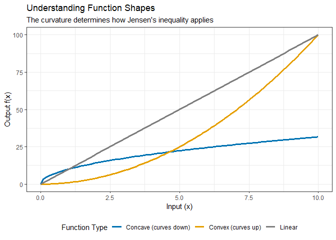
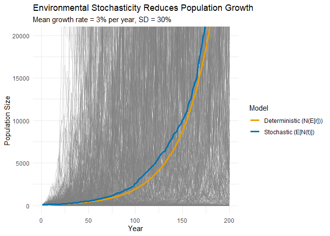

``` r
library(ggplot2)
library(dplyr)
```

## Introduction

Imagine you're managing a wildlife population. Over the past decade, the annual growth rate has averaged 5% per year. Simple math suggests the population should have grown by about 50% over that period, right? Wrong. And Jensen's inequality explains why.


## A Little History of Johan Jensen
I always like to know a tiny bit about the person that a theorem or important finding is named after because it helps me remember it. Johan Ludwig William Valdemar Jensen was a Danish mathematician and engineer and president of the Danish Mathematical Society from 1892 to 1903. Although he  studied in and published on topics in mathematics he never held an academic position in the subject. He instead worked as an engineer for the Copenhagen Telephone Company.

## Why Jensen's Inequality Matters
At its core, Jensen's inequality reveals a fundamental mathematical truth: **the average of a function is not the same as the function of the average**, or as an equation:

$$E[f(x)] \neq f(E[x])$$

The fact that this is true matters for broadly when we are tasked with modeling rates of change (whether these be population growth or return rates on a investment). 

## What Are Concave and Convex Functions?

Before diving into population ecology, let's understand what we mean by convex and concave functions—these terms describe the "shape" of a curve.


``` r
# create some dummy data for demonstration
x <- seq(0, 10, length.out = 100)

# convex function: curves upward (like a smile or the letter 'u')
convex_y <- x^2

# Concave function: curves downward (down like a frown)
concave_y <- sqrt(x) * 10

# Linear function for comparison
linear_y <- x * 10

# Combine into dataframe
demo_data <- data.frame(
  x = rep(x, 3),
  y = c(convex_y, concave_y, linear_y),
  type = rep(c("Convex (curves up)", "Concave (curves down)", "Linear"), 
             each = length(x))
)

ggplot(demo_data, aes(x = x, y = y, color = type)) +
  geom_line(linewidth = 1.2) +
  scale_color_manual(values = c("Convex (curves up)" = "#E69F00",
                                 "Concave (curves down)" = "#0072B2",
                                 "Linear" = "gray50")) +
  labs(
    title = "Understanding Function Shapes",
    subtitle = "The curvature determines how Jensen's inequality applies",
    x = "Input (x)",
    y = "Output f(x)",
    color = "Function Type"
  ) +
  theme(legend.position = "bottom")
```

<!-- -->

**Key insight:** 
- **Convex functions** (curving upward like $x^2$ or $e^x$): The function of the average is *less than* the average of the function.
- **Concave functions** (curving downward like $\sqrt{x}$ or $\log(x)$): The function of the average is *greater than* the average of the function.
- **Linear functions**: No difference—the average of the function equals the function of the average.

## Population Growth

Population growth rates provide a perfect example of why Jensen's inequality matters in ecology. Consider the classic exponential growth model:

$$N_t = N_0 e^{kt}$$

where:
- $N_t$ = population size at time $t$
- $N_0$ = initial population size
- $k$ = growth rate
- $t$ = time

This model tells us that to predict population size at any future time $t$, we multiply the starting population by $e^{kt}$. Simple enough—but here's the rub.


``` r
# as always we want to set the seed for reproducibility
set.seed(123)

# Simulation parameters
n_years <- 200 # number of years to simulate
n_simulations <- 500 # number of simulations per year
N0 <- 100 # initial population size

# Growth rate varies: mean = 0.03 (3%), SD = 0.15 (15%)
r_mean <- 0.03
r_sd <- 0.3

# Simulate population trajectories
simulate_population <- function() {
  N <- numeric(n_years)
  N[1] <- N0
  
  # Random growth rates each year
  r <- rnorm(n_years - 1, mean = r_mean, sd = r_sd)
  
  for (t in 2:n_years) {
    N[t] <- N[t-1] * exp(r[t-1])
  }
  
  return(N)
}

# Run simulations
all_sims <- replicate(n_simulations, simulate_population())

# E[N(t)] - Average of the function (actual mean trajectory)
N_geometric_mean <- exp(rowMeans(log(all_sims)))
# N(E[r]) - Function of the average (using mean growth rate)
N_function_of_mean <- N0 * exp(r_mean * (0:(n_years-1)))

# We'll plot this to show the variation
sim_data <- data.frame(
  year = rep(1:n_years, n_simulations),
  N = as.vector(all_sims),
  sim = rep(1:n_simulations, each = n_years)
)


# combine for plotting
plot_data <- data.frame(
  year = 1:n_years,
  stochastic = N_geometric_mean,
  deterministic = N_function_of_mean
)

# Plot
ggplot(plot_data, aes(x = year)) +
  geom_line(data = sim_data, 
            aes(x = year, y = N, group = sim),
            color = "gray50", alpha = 0.3, linewidth = 0.3) +
  geom_line(aes(y = deterministic, color = "Deterministic (N(E[r]))"), 
            linewidth = 1.2) +
  geom_line(aes(y = stochastic, color = "Stochastic (E[N(t)])"), 
            linewidth = 1.2) +
  scale_color_manual(
    values = c("Deterministic (N(E[r]))" = "#E69F00",
               "Stochastic (E[N(t)])" = "#0072B2")
  ) +
  labs(
    title = "Environmental Stochasticity Reduces Population Growth",
    subtitle = paste0("Mean growth rate = ", r_mean*100, "% per year, SD = ", 
                     r_sd*100, "%"),
    x = "Year",
    y = "Population Size",
    color = "Model"
  ) +
    coord_cartesian(ylim = c(0, 20000)) +  # Focus on the relevant range
  theme(legend.position = c(0.02, 0.98), 
        legend.justification = c(0, 1),
        legend.background = element_rect(fill = "white", color = "gray80"))+
theme_minimal()
```

<!-- -->

The deterministic model (orange) overestimates population growth compared to the geometric mean (blue). After 50 years, the deterministic model predicts 435, while the geometric mean is only 521

**Why?** Because $e^x$ is convex. By Jensen's inequality:

$$E[e^r] > e^{E[r]}$$

## The Math Behind It

For those interested in the formal statement:

**Jensen's Inequality:** For a convex function $f$ and random variable $X$:

$$E[f(X)] \geq f(E[X])$$

For a concave function, the inequality reverses ($\leq$) so:

$$E[f(X)] \leq f(E[X])$$

**In population ecology:**
- If $N_{t+1} = N_t e^{r_t}$ and $r_t$ varies randomly
- Then $E[N_t] \neq N_0 e^{\bar{r} \cdot t}$
- Because $e^x$ is convex (curves upward)

The **size of the gap** depends on:
1. **Variance of $X$**: More variable → bigger gap
2. **Curvature of $f$**: More nonlinear → bigger gap

This is why environmental stochasticity matters more for processes with highly nonlinear relationships.

## Practical Implications

1. **Never substitute means into nonlinear functions** expecting to get mean outcomes.
2. **Report both mean and variance** of vital rates - both matter for population projections.
3. **Use simulation** Stochastic models naturally account for Jensen's inequality.
4. **Check your function's curvature** - Is it convex, concave, or linear? This determines the direction of bias.


## Conclusion

Jensen's inequality is more than mathematical formalism—it's a reason why the systems we model surprise us. Every time we substitute an average into a nonlinear relationship, we're making a prediction that's systematically biased. This has relevance beyond ecological systems as well. Consider returns on investment, infection spread, or chemical reaction rates. Jensen's inequality will come into play in all of those cases. 

The next time someone shows you a deterministic population model with "average" parameter values, ask yourself: is this relationship linear? If not, remember Jensen's inequality. 

---

## References
- [https://en.wikipedia.org/wiki/Johan_Jensen_(mathematician)](https://en.wikipedia.org/wiki/Johan_Jensen_(mathematician))
- Doak, D. F., J. A. Estes, B. S. Halpern, U. Jacob, D. R. Lindberg, J. Lovvorn, D. H. Monson, M. T. Tinker, T. M. Williams, J. T. Wootton, I. Carroll, M. Emmerson, F. Micheli, and M. Novak. 2008. Understanding and Predicting Ecological Dynamics: Are Major Surprises Inevitable. Ecology 89:952–961.
- [Concave and Convex Functions](https://www.geeksforgeeks.org/engineering-mathematics/convex-and-concave-functions/)
- Denny, M. (2017). The fallacy of the average: on the ubiquity, utility and continuing novelty of Jensen's inequality. *Journal of Experimental Biology*, 220(2), 139-146.
